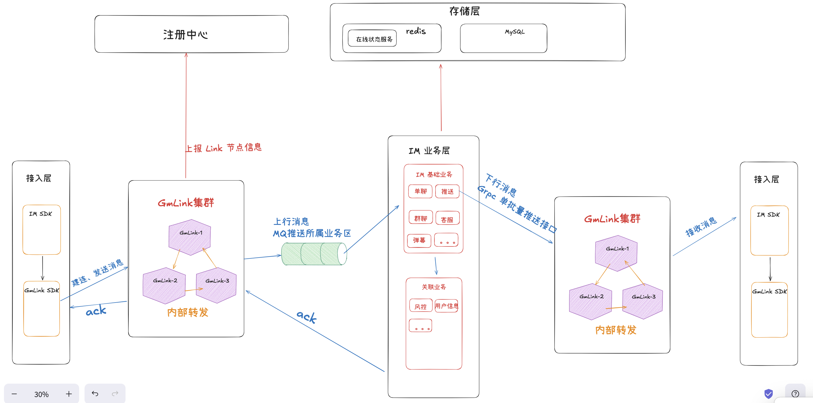
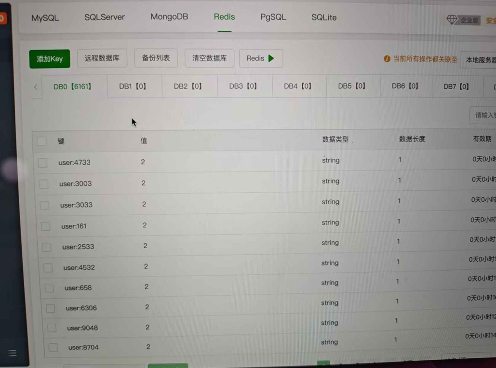

# 架构图

# 中台连接数测试
机器配置情况：

windows笔记本（8C16G）：搭载 Nacos注册中心、客户端

2020 macbook pro Intel：搭载 Kafka、光芒Link、光芒Server

远程Linux 服务器（2C4G）：搭载 Redis

客户端通过发送连接请求，光芒Link将在线状态写入Redis，通过Redis同时在线key，判断连接数

实际测试连接数为6161，凭借Netty出色的性能，连接数定远不如此

瓶颈在于搭载光芒Link的机器的内存，以及客户端实际是通过单机模拟，无法发送大量连接请求

