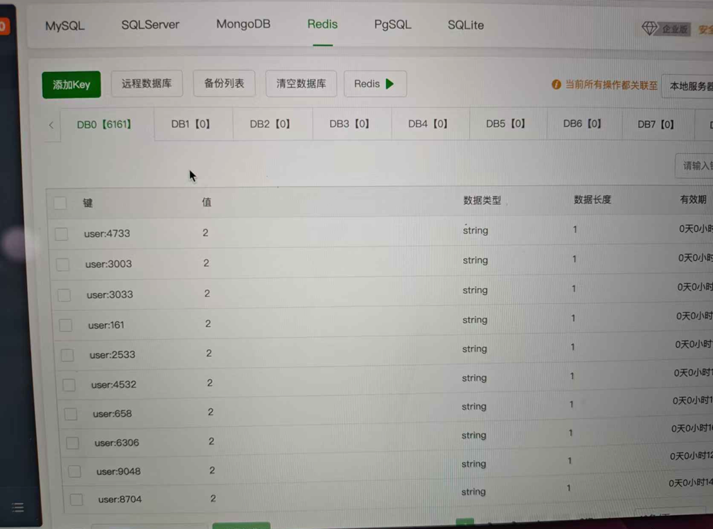

# 1.系统设计文档
链接：https://www.yuque.com/xexgm/gh8ccu/gidnp15xukhi0c92

# 2.系统全链路流程图

# 3.链路可用性与连接数测试（旧链路）
机器配置详情：

windows笔记本（8C16G）：运载 Nacos注册中心、客户端

2020 macbook pro Intel：运载 Kafka、GmLink、GmServer(业务服务)

Linux 服务器（2C4G）：运载 Redis

客户端发送连接请求，GmLink转发至业务服务，在线状态写入Redis，通过Redis同时在线key，判断连接数

实机粗略测试，连接数：6161

单机连接数瓶颈分析：

1.单服务器内存。TCP连接占用socket（自身内存占用+读写缓冲区），进程可创建的socket有限

2.cpu性能。大量java线程上下文切换，cpu性能受限

3.网络线程处理模型。网络IO，需要线程处理后续逻辑，线程占用远比 socket 占用大得多

4.服务器网卡带宽。服务器网卡带宽有限，无法支撑大量连接同时传输数据